# RoboQuestApp

This is an app designed to create and store robot rpg character data. Users can create, list, search, edit or delete robots from the database. This app was developed using Angular, Node Js and MongoDB.

## Getting Started

### Downloading the project

You can download this project either by cloning the repository or by downloading it as a zip file.

### Prerequisites

Before running the application, you will need to install the needed node js components. Open the robo-quest folder in the command line or open the server.js file in the backend folder and run the following commands.
```
npm install express
npm install mongoose
npm install cors
```
to install the necessary components to run the app.

### Running the app

This app uses MongoDB so an internet connection is required to use the features of the app.

#### Server

* Open the project in a code editor, preferably Visual Studio Code.
* Find the server.js file in the backend folder
* Open it in terminal and run
```
node server.js
```

#### Angular app

* Open the folder in the command prompt
* Run the following command to run the angular app in the browser.
```
ng serve --open
```

### App Features

#### Home Page

When you load the app, you will see the home page.

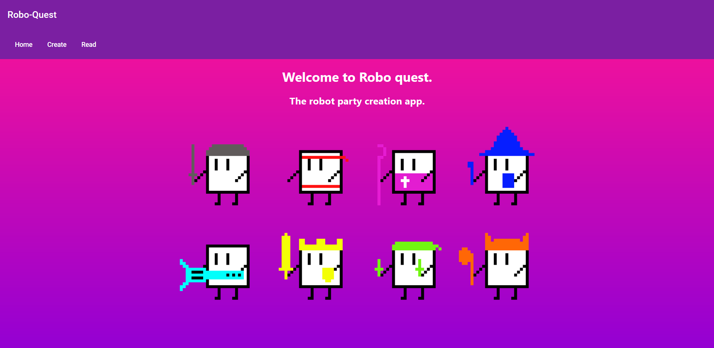

Here you can click on tabs to access other pages of the application.

#### Create Page

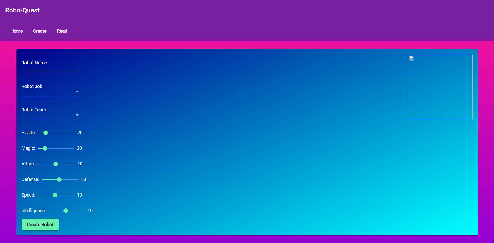

This page allows you to create a new robot and add it to the database. You will need to give the robot a name and assign it a job and team. The app will display a snackbar pop up if the form is not filled out completely.

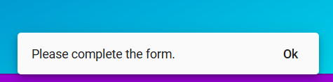

The snackbar is also used to display other messages to the user in the app.

The app provides a list of available jobs and teams to set on the robot.

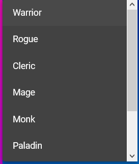 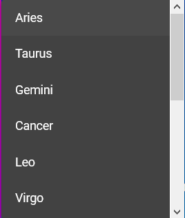

When you select a job for the robot, the image on the right will change to reflect this change
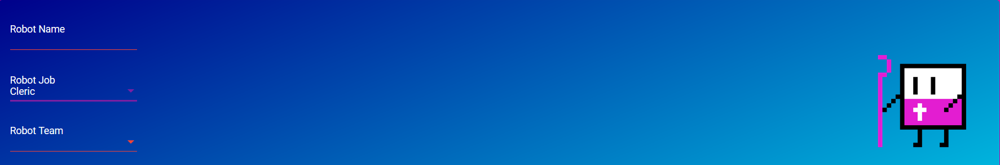

The stats of the character can be adjusted using the sliders on the page. The values are set between a range of values.


When you click create robot, the form data will be sent on to the server which will upload it to MongoDB, the form will then reset allowing you to create a new robot immediately.

#### Read Page

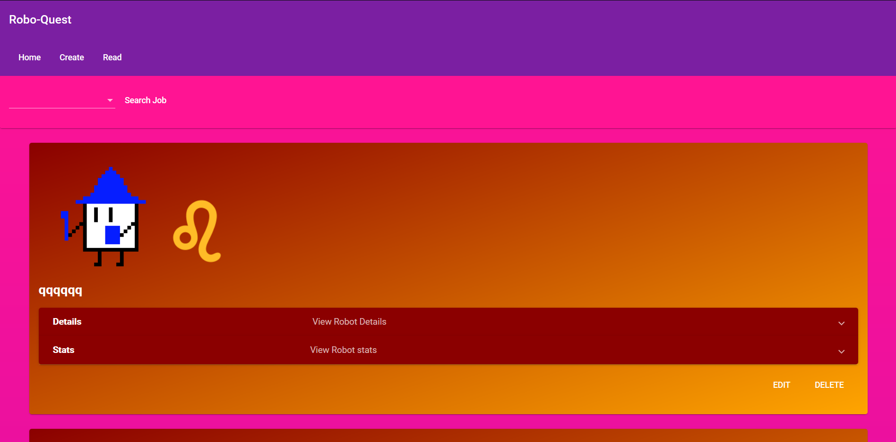

This page will list all of the robots stored within the database, this page will show the robot name along with two images. These images are dependant on the job and team selection of the robot. There are also expansion panels which show the job and team in text form along with a panel to show the stats of the robot.


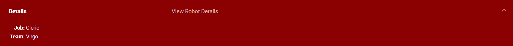

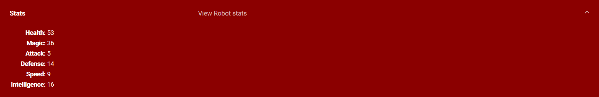

Each robot card also provides an edit button and a delete button, if you click the delete button, it will remove the robot from the database and reload the page immediately. A snackbar notification will inform you what just happened. By clicking the edit button, you will be brought to the Edit Robot component. The read page also has a search box where you can enter a job and filter the robot list to only include that job.

#### Edit Page

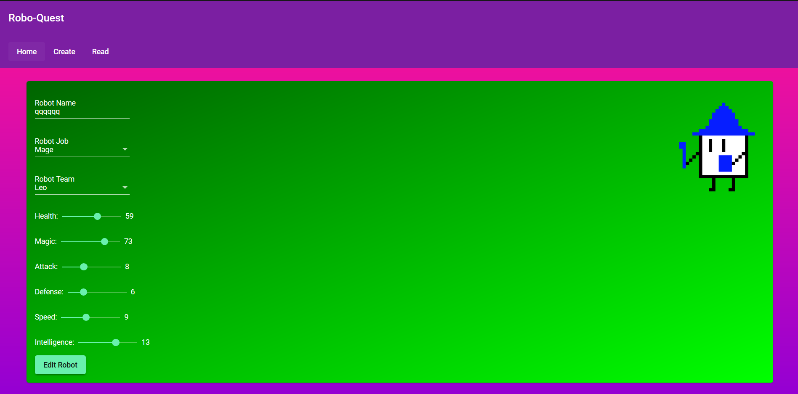

This page is only accessable by clicking the edit button on a robot. This page has a similar form to the create page but on load it loads the data of the selected robot and diplays it in the form. This way you can quickly change the values of the Robot. When you have finished editing the robot details and click Update Robot, you will be brought back to the read page where the data of the robot will have been updated.

#### Search Page

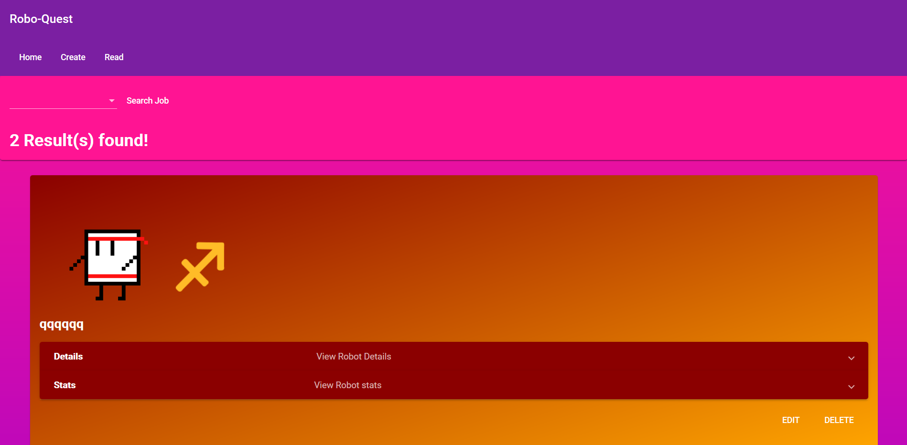

This page has all of the functionality of the read page except the list has been filtered to only include robots of a specified job. This page also displays how many robots have been found with that selected job.


